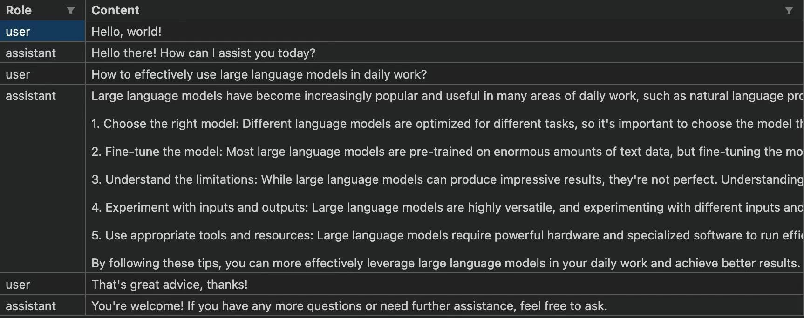

# README

## Functions
Very simple! Just chat and save.

* Chat like usual.

* Save chat history to .csv, where it summarizes a title for you.

* Note that when writing the history, the bot summarizes the entire chat, which might be token consuming. It's just that even with this functionailty on I think it pretty cheap. 
## Installation
### Get OpenAI API key
To get started, you need to create an OpenAI account.

1. Go to the OpenAI website (https://beta.openai.com/).
2. Login or Signup if you didn’t have the account.
3. Click on your profile at the top right
4. Click on the “View API keys”.
5. Click on the “Create new secret key”
6. The API key will be displayed on the screen.

### Configure the environment variable
1. Open the Terminal app.
2. Type `nano ~/.bash_profile` and press Enter. This will create or open the `.bash_profile` file in the nano text editor.
3. Type `export OPENAI_API_KEY=""variable_value""`, replacing ""variable_value"" with its value.
4. Type `export CHAT_HISTORY_DIR=/path/to/chat_history`, replacing `/path/to` with its value.
5. Press Control + X, then press Y to save the changes.
6. Type `source ~/.bash_profile` and press Enter to ensure that the changes are loaded into your current terminal session.

### Access anywhere on Unix/Mac
1. Open a Terminal
2. Type `pip install -e /path/to/chatgpt_cmd` and press Enter.
3. Now you can access the script by typing `chatgpt` in your terminal, have fun chatting! To finish a conversation, simply type `q` in the last line. Your chat history will be saved in .csv format.